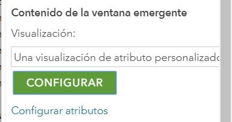

# Inmuebles en Asunción

Practicar sus conocimientos en representación cartográfica con datos de puntos.

### Requisitos

Crear un cuenta en ArcGIS Online de tipo Desarrollador y acceder a su espacio en [www.arcgis.com](https://www.arcgis.com). Tenga en cuenta de crear una carpeta en su espacio de contenido bajo el nombre **EJERCICIOS**.

## Resumen

ArcGIS online permite crear una vista de mapas en línea con qué interactuar y componer capas temáticas. En este ejercicio creará un mapa que muestre inmuebles ofertados en la ciudad de Asunción y también una aplicación sencilla para visualizar el mapa con algunos controles comunes de la cartografía Web. Se podrá visualizar la ubicación de los mismos con una simbología graduada en tamaño y una ventana emergente bastante informativa. Finalmente se compartirá el mapa dentro de una aplicación web personalizada para que otros usuarios puedan utilizarlo. 

### Guía de pasos

- [Crear capa alojada](#crear-capa-alojada)
- [Crear mapa web](#crear-mapa-web)
- [Compartir mapas web](#compartir-mapas-web)

## Crear capa alojada

Como parte del proyecto para consultar precios de inmuebles en Asunción se cuenta con un archivo para crear una capa alojada en ArcGIS Online con los inmuebles y sus características. Para este ejercicio utilizaremos la siguiente información:


La tarea es crear la capa alojada desde un archivo de CSV con los registros de los  inmuebles ubicados en diferentes barrios de Asunción. Para esta labor cuenta con algunos datos iniciales asociados a los inmuebles en el archivo *Inmuebles_Asuncion.csv* y disponibles en el enlace: [arcg.is/1Xy1SW](https://arcg.is/1Xy1SW).

La capa de puntos depende las columnas de la tabla denominadas **lat** y **lon** que serán utilizadas para suministrar la localización. En ArcGIS Online proceda a utilizar el botón *AGREGAR ELEMENTO* y elija la opción *DESDE EL EQUIPO*. Utiliza un dialogo como se muestra en la figura.


Los datos más importantes de este formulario son:

- *Archivo*: el CSV **Inmuebles_Asuncion.csv** a utilizar como fuente de información.
- *Título*: nombre de la capa. Ej. Inmuebles Asuncion 2019
- *Etiquetas*: datos adicionales para buscar información acerca del tema.
- Publicar este archivo como capa alojada: Tildar esta opción
- Localizar entidades por: Coordenadas
- En Campos de ubicación elegir *lon* e *lat* como columnas para Longitud y Latitud.

Una vez completado confirmar con el botón AGREGAR ELEMENTO. Debe tener en cuenta que puede tardar unos segundos para crear el contenido en la plataforma. El resultado obtenido será una nueva capa de puntos creada.


Puede acceder a los datos en forma tabular en la pestaña de DATOS y en la vista geográfica en VISUALIZACIÓN. Examine la información recientemente creada.


Los precios están guardados en dos monedas distintas Gs. y U$S dólares. 

### Estilo de capa

Vamos a proceder a configurar la capa directamente en la sección de visualización para preservar la simbología entre mapas.


Al acceder a la página de **Información General** y dirigiendo en la capa alojada dentro de la configuración de “Visualización”.  La simbología puede ser directamente configurada por medio de las opciones disponibles para el efecto.


Al examinar los datos de la tabla existen varios valores que puede cuantificar los puntos, entre ellos están *metros2* y *precio*. El problema con esta representación es que hay dos tipos de monedas U$S y Gs. (Guaraníes y Dólares). 

 

Se requiere unificar por medio de una **expresión** para poder mejorar esta clasificación visualización.


La expresión consiste en un lenguaje de ESRI donde se convierte lo que sea moneda Gs. a Dólares. La expresión queda cuanto sigue:

```
**IIf($feature.moneda != 'U$S', $feature.precio / 7000, $feature.precio)**
```

Si no es moneda en dólares entonces dividir por el cambio 7.000 Gs. El resultado se ve mejor representado y unificado en una sola moneda.


Se cambia la etiqueta de la propiedad personalizada a Precio.


Finalmente la capa queda simbolizada correctamente. Al acceder a opciones el rango visible debe estar en **Ciudades**. Y se procede a presionar GUARDAR.


### Ventana Emergente

También en esta vista de capa se debe configurar la ventana emergente por medio las siguientes personalizadas.


En el menú de opciones acceder a CONFIGURAR VENTANA EMERGENTE. Se debe escoger valores amigables para los usuarios como:

Título emergente: Elegir el Barrio y el precio junto con la moneda en una sola expresión.


Contenido emergente: Se debe poner el siguiente detalle amigable al usuario por medio de la opción “Una visualización de atributo personalizado”.



Se procede a describir el siguiente texto con el botón CONFIGURAR.


Se guardan los cambios al presionar ACEPTAR. 

Contenido multimedia: Para finalizar se configura el contenido multimedia en la última parte agregando contenido tipo imagen.


La configuración de la imagen debe ser con los siguientes detalles de Título, URL y Vínculo.


Se confirman los cambios con el botón ACEPTAR en todos los paneles y finalizada la configuración la ventana emergente queda configurada en la capa y se procede a GUARDAR CAPA.


## Crear mapa web

Adicionalmente se crea un mapa web para desplegar la información de inmuebles en una o más aplicaciones a partir de la capa alojada "Inmuebles Asuncion 2019". Como esta capa fue creada anteriormente se procede desde la sección CONTENIDO a acceder la INFORMACION GENERAL de la capa alojada y utilizar el botón ABRIR EN MAP VIEWER.


Asegurarse de crear un mapa nuevo, en caso del que el MapViewer abra un mapa anterior puede presionar el botón CREAR MAPA NUEVO. Una vez abierto el MapViewer se procede a GUARDAR el mapa con el título "Inmueble en Asunción", poner etiquetas correspondientes y guardar en la carpeta EJERCICIOS.


Luego para finalizar detalles se debe cambiar el mapa base de referencia a **OpenStreetMap**


Cambiar el nombre de la capa en la tabla de contenidos a Inmuebles y GUARDAR el mapa.

## Compartir mapa web

Luego de finalizar la edición del mapa puede proceder a compartir los mapas desde CONTENIDO por el enlace rápido y elegir TODOS.


Para capturar un enlace de su mapa puede acceder al ABRIR EN MAPVIEWER el mapa y presionar el botón COMPARTIR para capturar la URL corta de su mapa web.

 

La aplicación esta lista para publicarse como una aplicación Web.